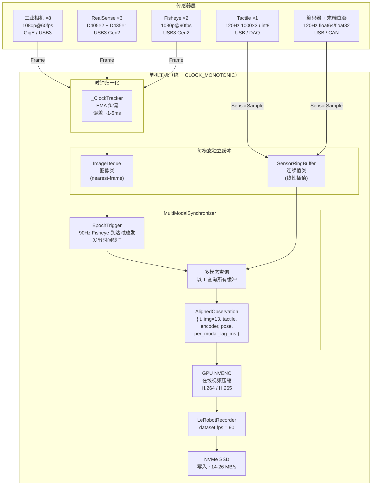
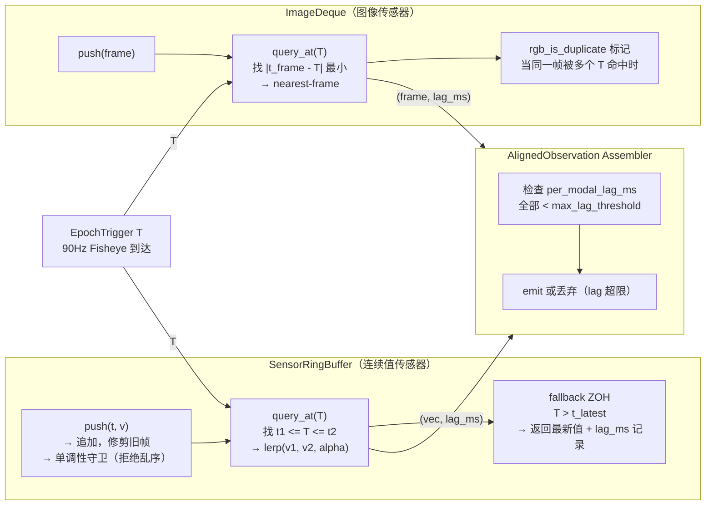
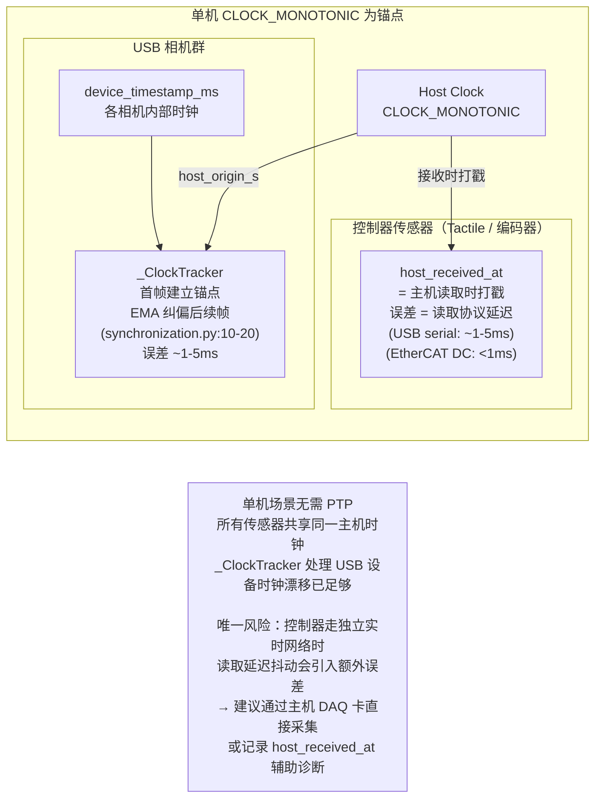

# Multi-Modal Sensor Sync Architecture（单机版）

Date: 2026-03-24

## 传感器配置

| 传感器 | 数量 | 规格 | 接口 |
|--------|------|------|------|
| 工业相机 | 8 | 1080p@60fps | GigE / USB3 |
| RealSense D405 | 2 | 彩色 1280×720@30fps，深度 848×480@30fps | USB3 Gen2 |
| RealSense D435 | 1 | 彩色 1080p@30fps，深度 1280×720@30fps | USB3 Gen2 |
| Fisheye | 2 | 1080p@90fps | USB3 Gen2 |
| Tactile | 1 | 120Hz，1000×3 uint8 | USB / DAQ |
| 编码器 | 1 | 120Hz，float64 | USB / CAN |
| 末端位姿 | 1 | 120Hz，7×3 float32 | USB / CAN |

> D405 实际最高彩色分辨率为 1280×720@30fps，D435 彩色最高 1080p@30fps，
> 不支持 1080p@60fps，规划时需注意。

---

## 图一：单机整体数据流



---

## 图二：同步器内部逻辑



---

## 图三：单机时钟归一化（无 PTP）



---

## 关键设计决策

### Epoch Trigger 选择

选 **90Hz Fisheye** 为 epoch trigger（不是 60Hz RGB）：

| 触发源 | 保全的传感器 | 被补帧的传感器 |
|--------|------------|--------------|
| 60Hz RGB | RGB 无损 | Fisheye 丢 33% |
| **90Hz Fisheye（选择）** | **Fisheye 无损** | RGB 约 33% 帧重复 |

RGB 重复帧用 `rgb_is_duplicate` 列标记，训练时可按需过滤。

### 缓冲区容量推算

```
容量 = 传感器频率 × 最大允许查询时延 × 安全系数
Tactile/Encoder：120Hz × 50ms × 2 = 12 帧
Fisheye：        90Hz  × 33ms × 2 = 6 帧
RGB/工业：       60Hz  × 50ms × 2 = 6 帧
```

### 时钟代码路径

| 场景 | 代码路径 | 误差量级 |
|------|---------|---------|
| 单机 USB 相机 | `_ClockTracker` EMA（synchronization.py:10-20） | ~1-5ms |
| 单机 + PTP（可选升级） | `global_time` 直通（synchronization.py:61-63） | ~10μs |

### recording.py 适配

`recording.py:96-104` 的 `resolve_recording_fps()` 遇到多 fps 会抛出异常。
单机方案只需在配置里显式指定 `recording.fps = 90`，现有代码走 `if config.recording.fps is not None` 分支直接返回，**无需改动代码**。

---

## 多相机同步方式对比

### 同步方式全面对比

| 维度 | 无同步 | 软同步（当前实现） | PTP 时钟同步 | 硬件触发（GPIO） | 硬件触发 + PTP |
|------|--------|-----------------|------------|----------------|--------------|
| **同步精度** | 无保证，偏差 ≤ 1/fps（~16ms@60Hz） | ~1-10ms | ~0.1-1ms | **<1μs（曝光时刻一致）** | **<1μs** |
| **对齐的是什么** | — | 接收时间戳 | 接收时间戳 | **曝光起始时刻** | 曝光起始时刻 |
| **帧内运动模糊差异** | 有 | 有 | 有 | **无** | 无 |
| **硬件成本** | 零 | 零 | 低（NIC + 软件） | 中（触发线/同步卡） | 中高 |
| **布线要求** | 无 | 无 | 无（走网络） | 需 GPIO 信号线 | 需 GPIO + 网络 |
| **相机限制** | 无 | 无 | 需支持 PTP | 需支持外部触发 | 两者都需要 |
| **异频传感器支持** | 天然支持 | 天然支持 | 天然支持 | **强制同频，难支持异频** | 难支持异频 |
| **实现复杂度** | 无 | 低（已实现） | 中（ptp4l + phc2sys） | 高（布线 + 驱动配置） | 高 |
| **当前代码支持** | — | ✅ synchronization.py | ✅ global_time 分支预留 | ⚠️ 字段预留未实现 | ⚠️ 未实现 |
| **适用任务** | 单目，无时序要求 | 大多数操作任务 | 触觉/力控精度提升 | 高速运动、立体视觉 | 最高精度要求 |

### 本系统的选择逻辑

硬件触发的核心代价是**强制同频**：本系统有 60Hz、90Hz、120Hz 三种频率，硬件触发要求所有相机统一在同一时刻曝光，Fisheye 90Hz 与工业相机 60Hz 无法同时满足，要么所有相机降至 60Hz，要么放弃异频传感器原生帧率。

```
操作任务速度 < 0.5 m/s（慢速抓取、装配）
  → 软同步已够用，5ms 误差对应 < 2.5mm 位置误差

操作任务速度 0.5-2 m/s（正常操作速度）
  → 软同步 + PTP，将误差压到 < 1ms

操作任务速度 > 2 m/s，或需要精确立体重建
  → 硬件触发，但须接受所有相机统一降至 60Hz
```

大多数机器人操作学习场景**软同步 + PTP 已经足够**，硬件触发是精度换灵活性的主动取舍。
