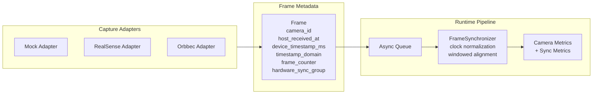
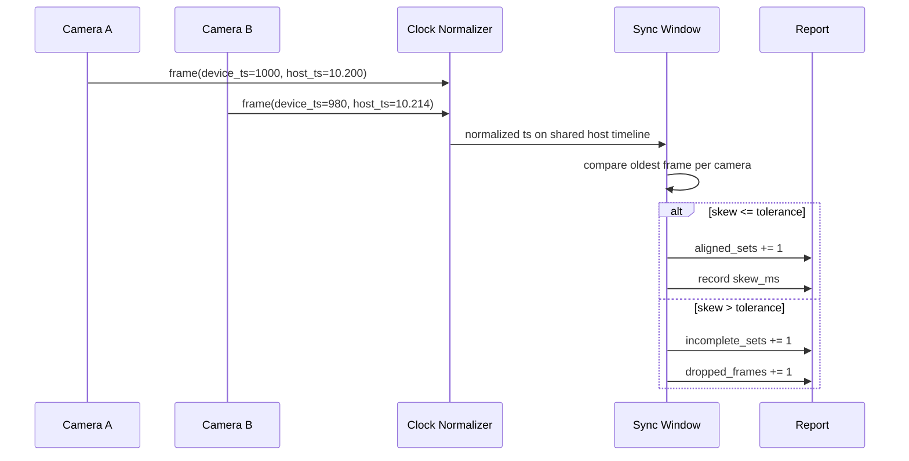
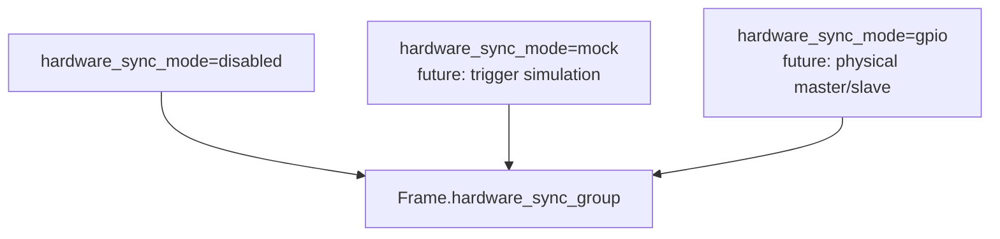
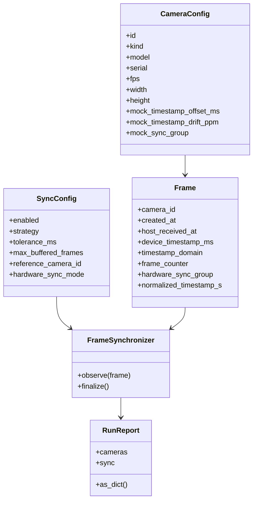

# RealSense Sync Architecture Evaluation

Date: 2026-03-11

## Decision

The current implementation will **not** assume `8`-camera hardware sync as a prerequisite.

Near-term direction:

- keep the capture image on `Ubuntu 22.04`
- do **not** introduce `ROS 2` into the hot capture path yet
- preserve camera-native timestamps and host receive timestamps
- use a software synchronizer to align frames on a normalized device-clock timeline
- reserve a `mock`-level hardware sync hook so later GPIO or trigger-line experiments can be introduced without reshaping the pipeline

`ROS 2` is still optional later, but only as a bridge layer after the capture and sync model are stable.

## What Changed In Code

The repository now has a first-pass sync architecture:

- `Frame` keeps host/device timing metadata instead of only `time.monotonic()`
- `mock`, `realsense`, and `orbbec` adapters all emit richer timing data
- `FrameSynchronizer` performs device-clock normalization plus approximate multi-camera alignment
- `RunReport` now includes a `sync` section with aligned set count, dropped sync frames, skew, pending buffers, per-camera offset/drift estimates, and sync-health warnings
- config files now expose a `sync` block and `mock_*` timing knobs

## Why This Path

For `8`-way timestamp work, the main problem is not transport, it is time semantics:

- each device clock has a different epoch
- host scheduling adds receive jitter
- USB buffering hides the true capture order
- a middleware bus does not fix incorrect timestamps

So the correct order is:

1. preserve timing metadata
2. normalize clocks
3. evaluate skew and drift
4. only then decide whether hardware sync or ROS 2 is justified

## Current Architecture

## Synchronization Mechanism

The current synchronizer is a **software sync** strategy:

1. For each camera, the first frame establishes a mapping between `device_timestamp_ms` and `host_received_at`.
2. Later frames reuse that mapping and apply a small correction term to absorb receive jitter.
3. Each camera keeps a short buffer.
4. The synchronizer compares the oldest buffered frame from each camera.
5. If their normalized timestamps fall inside the configured tolerance window, the set is counted as aligned.
6. If not, the earliest frame is discarded from the sync window and counted as an incomplete set.

This is appropriate for the current phase because it gives us measurable skew and loss behavior without pretending the devices are already electrically synchronized.

## Reserved Hardware Sync Hook

We are **not** enabling real hardware sync by default, but the interface is now reserved in the right places:

- `RunConfig.sync.hardware_sync_mode`
- `CameraConfig.mock_sync_group`
- `Frame.hardware_sync_group`

That means later we can attach:

- mock trigger-line simulation
- RealSense GPIO master/slave experiments
- hardware-sync-aware diagnostics

without replacing the current pipeline contract.

## Code Map

## Base Image Recommendation

Keep the main capture image on `ubuntu:22.04`.

If `ROS 2` is needed later, add a separate bridge image instead of changing the core capture image in place:

- `sensor-hw-core`: capture only
- `sensor-hw-ros`: ROS 2 bridge only

Reasoning:

- the current RealSense and Orbbec build path is already stabilized on `22.04`
- `ROS 2 Humble` is the low-risk fit for `22.04`
- moving to `24.04` now would mix SDK risk with architecture risk

Official references checked on 2026-03-11:

- ROS 2 Humble: https://docs.ros.org/en/humble/Installation.html
- ROS 2 Jazzy: https://docs.ros.org/en/jazzy/Installation.html
- ROS docs index: https://docs.ros.org/

## Full Plan

### Phase 1: Done

- [done] expand frame timing metadata
- [done] add software synchronization in the pipeline
- [done] add mock timing knobs for offset, drift, and future sync grouping
- [done] expose sync results in the report
- [done] document the architecture with diagrams

### Phase 2: Done

- [done] add per-camera offset and drift estimates to the report
- [done] emit sync-health warnings when a camera repeatedly falls out of the window
- [done] add a mock profile dedicated to `8`-camera skew and drift stress testing

Implemented assets:

- `configs/mock-8cam-sync-stress.json`
- `sync.per_camera.*` report fields
- `sync.warnings`

### Phase 3: In Progress

- [done] add `2`-camera RealSense session template
- [done] add `4`-camera RealSense session template
- [done] define the report metrics to inspect during real hardware validation
- [done] define the USB topology check before any GPIO sync wiring
- [pending] execute a `2`-camera RealSense bench run
- [pending] execute a `4`-camera RealSense bench run
- [pending] scale toward `8` cameras after the smaller runs are stable

Phase 3 is intentionally not marked fully done here because the repository now contains the configs and reporting support needed for those runs, but the actual multi-camera bench execution still depends on having `2` and then `4` physical RealSense devices connected.

### Phase 4: Optional hardware sync

- add a real hardware sync controller abstraction
- support RealSense master/slave trigger roles
- compare `hardware_sync_mode=disabled` vs hardware sync runs with the same report schema

### Phase 5: Optional ROS 2 bridge

- create `sensor-hw-ros`
- publish only selected synchronized outputs and metadata
- keep raw capture and clock normalization in `sensor-hw-core`

## Bottom Line

- default path: software sync first
- hardware sync: reserved, not required yet
- ROS 2: optional bridge, not foundation
- next useful milestone: make the report quantify skew, drift, and sync-health well enough that `8`-camera decisions are data-driven

## Current Status Snapshot

As of 2026-03-11:

- `Phase 1` is done in code and documented.
- `Phase 2` is done in code, tested, and available through the new report schema plus the `8`-camera mock stress profile.
- `Phase 3` is prepared but not fully done:
  - the repository now has `2`-camera and `4`-camera RealSense session templates
  - the repository now reports the metrics needed for staged hardware validation
  - actual `2`-camera and `4`-camera RealSense bench execution still requires the corresponding physical devices to be connected

This means the software stack is ready for staged multi-camera validation, but the remaining `Phase 3` completion criteria are hardware-execution tasks rather than missing code structure.
