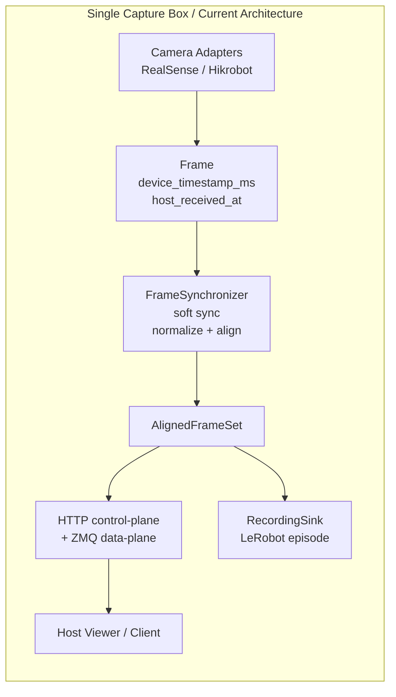
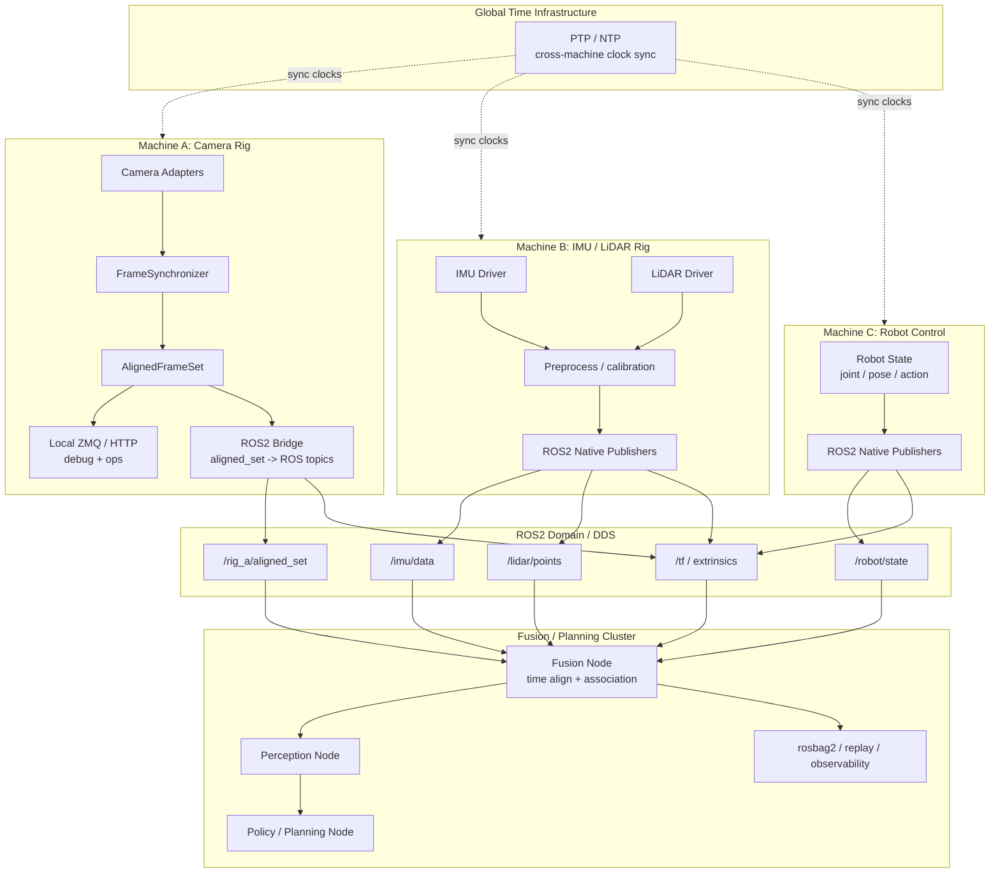
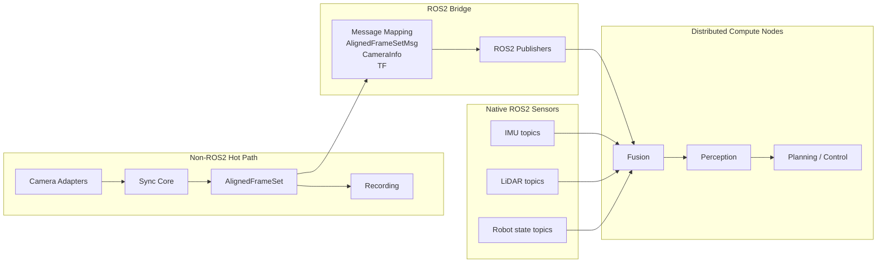

# ROS2 Bridge Multi-Machine Architecture

Date: 2026-03-23

## Goal

Capture the current `sensor_proto` architecture and the recommended next-step architecture for:

- multi-machine deployment
- multi-sensor fusion
- ROS2 ecosystem integration

The core recommendation remains:

- keep `sensor_proto` responsible for capture-time truth
- keep the hot capture path outside ROS2
- add ROS2 as a bridge layer after `AlignedFrameSet` is formed

## Current Architecture

## Target Architecture

## Responsibility Split

## Design Rules

- `sensor_proto` owns capture-time truth: device timestamps, host receive timestamps, per-camera drift, sync-window behavior, and `AlignedFrameSet` semantics.
- ROS2 bridge owns interoperability: topic publication, `tf`, standard message mapping, and downstream integration.
- Recording should continue consuming in-memory `AlignedFrameSet`, not re-decoded ROS2 or JPEG payloads.
- Cross-machine time sync must exist before downstream fusion claims temporal correctness.

## Why The Bridge Sits After Alignment

- ROS2 can transport timestamps; it does not make bad timestamps correct.
- Camera-device clocks, USB jitter, and sync-window drop behavior are repository-specific concerns already modeled by `sensor_proto`.
- Downstream fusion nodes should consume a stable observation-step abstraction, not rebuild camera alignment from raw per-camera traffic.
